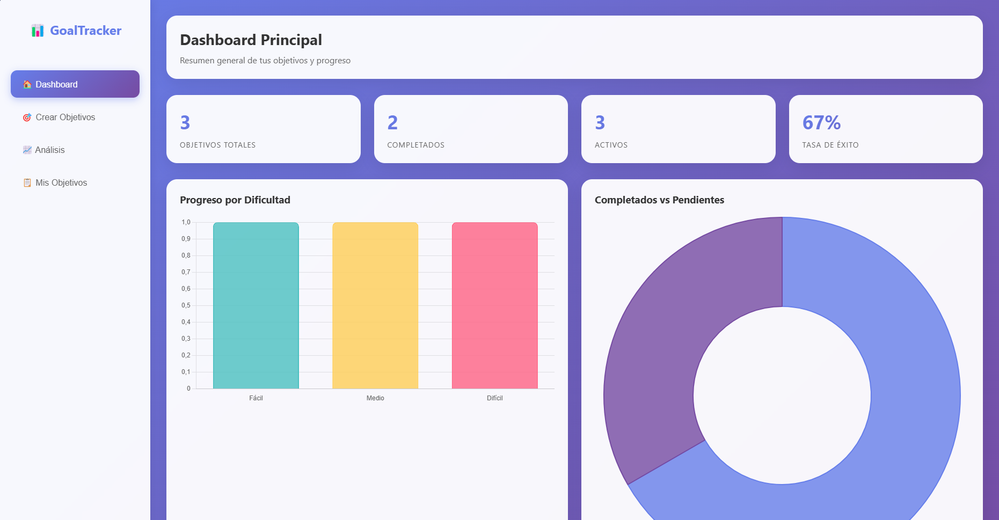
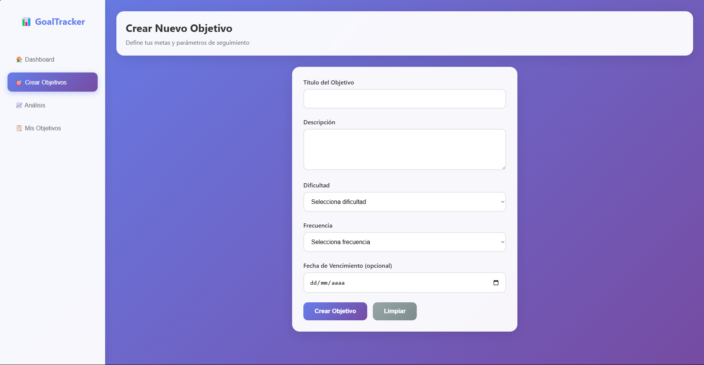
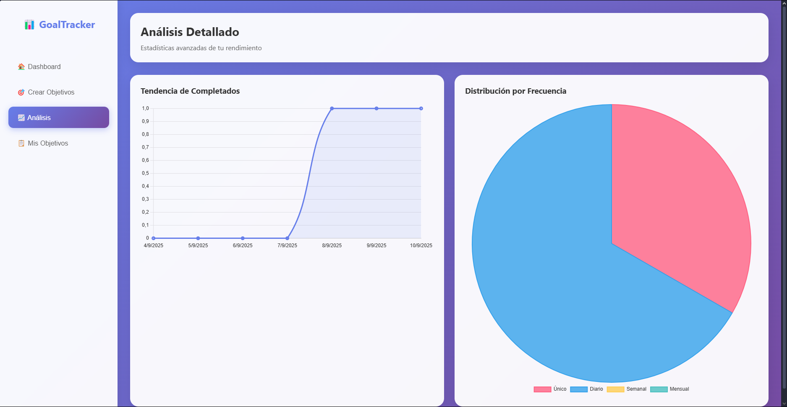
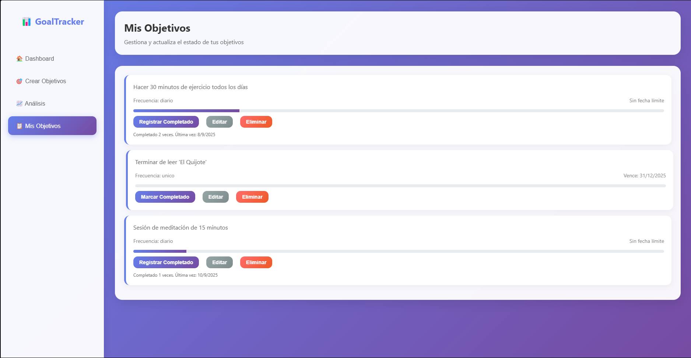

# Dashboard de Objetivos a cumplir
Dashboard donde puedes agregar tus objetivos, indicando si este es para un solo uso o para mayor frecuencia, dentro del menu de mis objetivos, puedes modificarm, eliminar o completar los desafios, que se veran reflejados en el dashboard y en el analisis

# Indice de contenidos:
- [ Caracteristicas](#caracteristicas)
- [ Instalacion](#instalacion)
- [ Capturas](#capturas)
- [ Tecnologias](#tecnologias)
- [ Licencia](#licencia)


# Caracteristicas:
> -Tiene un dashboard con graficas y contadores de objetivos

> -Cuenta con el apartado para crear tus objetivos y personalizarlos al maximo

> -Cuenta con un apartado donde ver una grafica de las fechas donde cumpliste o no

> -Tienes una lista de desafios modificables para completar

# Instalacion:
```bash
git clone https://github.com/Adri-Coding-Dev/DashBoard_Objetivos
cd DashBoard_Objetivos
# Ejecutar el index.html en tu navegador favorito
```

# Capturas:
## DashBoard Principal:

## Crear Objetivos:

## Analisis grafico del avance:

## Recopilatorio de Objetivos:


# Tecnologias:
> -HTML5

> -CSS3

> -JavaScript

# Licencia:
Este proyecto esta bajo la licencia MIT